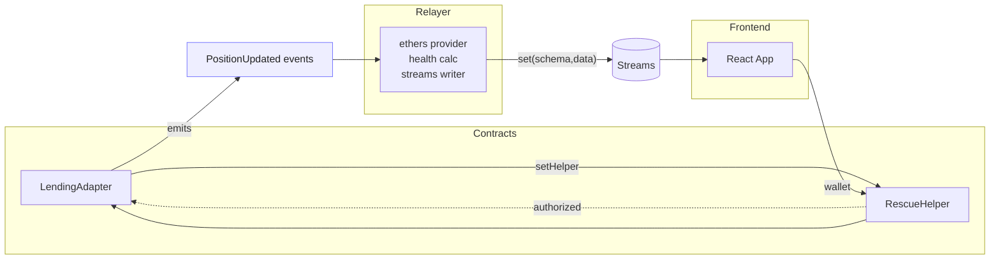

# RescueStream

Realtime DeFi position telemetry + privileged rescue flow for Somnia networks.

Monorepo structure:
- contracts (Hardhat Solidity): `LendingAdapter`, `RescueHelper`
- relayer (Node.js TypeScript): listens to on-chain `PositionUpdated`, computes health, writes to Streams
- frontend (React + Vite): streams dashboard, alerts, and rescue UX

## Architecture



Key flows:
- Positions are updated by protocol owner or `RescueHelper` via `LendingAdapter.setPosition` (helper is ACL’d).
- `PositionUpdated` events feed the relayer which computes health and pushes normalized rows to Streams.
- The UI polls Streams for the latest rows, renders risk, and can trigger `rescueTopUp` on `RescueHelper`.

## Features
- Authorization: `LendingAdapter` allows owner or configured `helper` to write positions.
- Safety: `RescueHelper` enforces non-decreasing collateral and a configurable `maxTopUpDelta`.
- Observability: relayer exposes `/healthz` and `/metrics`.
- Frontend: risk highlighting, search, details, and rescue modal.

## Local Development

Prereqs: Node 18+, npm, Git.

1) Install (avoid OneDrive locking):
```
npm ci --ignore-scripts
npm rebuild esbuild
```

2) Compile contracts:
```
npx hardhat compile
```

3) Start local chain (keep running):
```
npx hardhat node
```

4) Deploy to localhost:
```
npx hardhat run deploy/deploy.ts --network localhost
```
Note deployed addresses printed to console; `deploy/deploy.ts` also wires `setHelper`.

5) Start relayer (new terminal):
```
cd relayer
SOMNIA_RPC_URL=http://127.0.0.1:8545 \
LENDING_ADDR=<LendingAdapter address> \
PRIVATE_KEY=0xac0974be...ff80 \
LOG_LEVEL=info \
PORT=8080 \
npx ts-node src/index.ts
```

6) Start frontend (new terminal):
```
cd frontend
VITE_SOMNIA_RPC_URL=http://127.0.0.1:8545 \
VITE_RESCUE_HELPER_ADDRESS=<RescueHelper address> \
VITE_POSITION_SCHEMA_ID=0x00...00 \
VITE_POSITION_PUBLISHER=0x0000000000000000000000000000000000000000 \
npm run dev
```

## Production Deploy Notes
- Contracts: configure `maxTopUpDelta`, and set helper via `setHelper(RescueHelper)` post-deploy.
- Relayer: replace stub pricing with oracle feeds; persist last processed block.
- Frontend: set real Streams `schemaId` and `publisher` and configure WalletConnect ID.

## Repository Topics
Suggested topics: `defi`, `somnia`, `realtime`, `streams`, `hardhat`, `ethers`, `vite`, `react`, `solidity`.

## License
MIT

