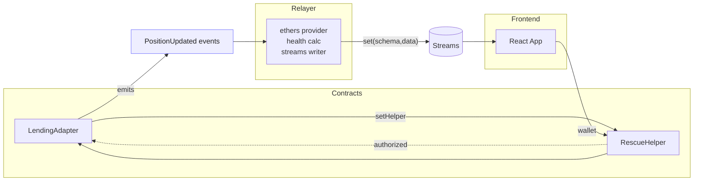

# 🚨 RescueStream

**Real-time DeFi Position Monitoring & Automated Rescue System for Somnia Networks**

RescueStream is a comprehensive DeFi position monitoring platform that provides real-time health tracking, automated rescue capabilities, and an intuitive dashboard for managing lending positions on Somnia blockchain networks. Built with production-ready smart contracts, a robust relayer service, and a modern React frontend.

## 🌟 Overview

RescueStream monitors DeFi lending positions in real-time, calculating health factors, tracking liquidation risks, and providing automated rescue mechanisms to protect user positions. The platform integrates with Somnia Data Streams for real-time updates and uses Chainlink oracles and DEX price feeds for accurate position valuation.

### Key Capabilities

- 📊 **Real-time Position Monitoring**: Live health factor tracking with instant updates via Somnia Streams
- 🔔 **Automated Alerts**: Browser notifications and audio alerts for at-risk positions
- 🤖 **Rescue Bot**: Automated position rescue system with configurable thresholds
- 📈 **Price Oracle Integration**: Chainlink and DEX price feeds with fallback mechanisms
- 💼 **Wallet Integration**: Seamless wallet connection via RainbowKit (MetaMask, WalletConnect)
- 🎨 **Modern UI**: Responsive dashboard with position analytics, charts, and transaction history
- 🔒 **Security First**: Audited OpenZeppelin contracts with reentrancy protection and access controls

Monorepo structure:
- contracts (Hardhat Solidity): `LendingAdapter`, `RescueHelper`
- relayer (Node.js TypeScript): listens to on-chain `PositionUpdated`, computes health, writes to Streams
- frontend (React + Vite): streams dashboard, alerts, and rescue UX

## Architecture



Key flows:
- Positions are updated by protocol owner or `RescueHelper` via `LendingAdapter.setPosition` (helper is ACL’d).
- `PositionUpdated` events feed the relayer which computes health and pushes normalized rows to Streams.
- The UI polls Streams for the latest rows, renders risk, and can trigger `rescueTopUp` on `RescueHelper`.

## ✨ Features

### Smart Contracts
- **LendingAdapter**: Flexible position management with owner and helper authorization
- **RescueHelper**: Secure rescue mechanism with non-decreasing collateral enforcement
- **Access Control**: Role-based permissions with OpenZeppelin Ownable
- **Reentrancy Protection**: Safe contract interactions with ReentrancyGuard

### Relayer Service
- **Event Listening**: Real-time blockchain event monitoring with WebSocket support
- **Health Calculation**: Advanced position health computation with liquidation thresholds
- **Price Oracle**: Multi-source price feeds (Chainlink, Uniswap V2/V3, fallback)
- **Circuit Breaker**: Automatic fallback when price feeds fail
- **Rescue Bot**: Automated rescue execution with rate limiting
- **REST API**: Comprehensive API for metrics, bot control, and transaction history

### Frontend Dashboard
- **Real-time Streaming**: Live position updates via Somnia Data Streams
- **Health Factor Visualization**: Interactive charts and sparklines
- **Position Analytics**: Detailed metrics including liquidation price and thresholds
- **Transaction History**: Complete rescue transaction tracking
- **Bot Configuration**: Dynamic bot settings management
- **Alert System**: Audio and browser notifications with configurable cooldowns
- **Responsive Design**: Optimized for desktop and mobile devices
- **Performance Optimized**: Virtualized lists for large datasets

## Local Development

Prereqs: Node 18+, npm, Git.

1) Install (avoid OneDrive locking):
```
npm ci --ignore-scripts
npm rebuild esbuild
```

2) Compile contracts:
```
npx hardhat compile
```

3) Start local chain (keep running):
```
npx hardhat node
```

4) Deploy to localhost:
```
npx hardhat run deploy/deploy.ts --network localhost
```
Note deployed addresses printed to console; `deploy/deploy.ts` also wires `setHelper`.

5) Start relayer (new terminal):
```
cd relayer
SOMNIA_RPC_URL=http://127.0.0.1:8545 \
LENDING_ADDR=<LendingAdapter address> \
PRIVATE_KEY=0xac0974be...ff80 \
LOG_LEVEL=info \
PORT=8080 \
npx ts-node src/index.ts
```

6) Start frontend (new terminal):
```
cd frontend
VITE_SOMNIA_RPC_URL=http://127.0.0.1:8545 \
VITE_RESCUE_HELPER_ADDRESS=<RescueHelper address> \
VITE_POSITION_SCHEMA_ID=0x00...00 \
VITE_POSITION_PUBLISHER=0x0000000000000000000000000000000000000000 \
npm run dev
```

## Production Deployment

See [DEPLOYMENT.md](./DEPLOYMENT.md) for complete production deployment instructions.

### Quick Deploy to Vercel

```bash
cd frontend
vercel login
vercel --prod
```

Set environment variables in Vercel dashboard:
- `VITE_SOMNIA_RPC_URL`
- `VITE_RESCUE_HELPER_ADDRESS`
- `VITE_POSITION_SCHEMA_ID`
- `VITE_POSITION_PUBLISHER`
- `VITE_RELAYER_URL` (optional)
- `VITE_WALLETCONNECT_ID` (optional)

### Production Notes
- Contracts: configure `maxTopUpDelta`, and set helper via `setHelper(RescueHelper)` post-deploy.
- Relayer: replace stub pricing with oracle feeds; persist last processed block.
- Frontend: set real Streams `schemaId` and `publisher` and configure WalletConnect ID.
- All hardcoded localhost URLs have been removed - use environment variables.

## 🛠️ Tech Stack

- **Smart Contracts**: Solidity, Hardhat, OpenZeppelin
- **Relayer**: Node.js, TypeScript, Express, Ethers.js
- **Frontend**: React, TypeScript, Vite, RainbowKit, Wagmi, Viem
- **Data Streaming**: Somnia Data Streams SDK
- **Testing**: Jest, Vitest, React Testing Library
- **Security**: Slither, MythX (CI/CD integrated)
- **Deployment**: Vercel (frontend), Railway/Render (relayer)

## 📚 Documentation

- **[DEPLOYMENT.md](./DEPLOYMENT.md)**: Complete production deployment guide
- **[docs/api.md](./docs/api.md)**: Relayer REST API documentation
- **[SECURITY.md](./SECURITY.md)**: Security policy and best practices

## 🏗️ Project Structure

```
rescuestream/
├── contracts/          # Solidity smart contracts
│   ├── LendingAdapter.sol
│   └── RescueHelper.sol
├── relayer/            # Node.js TypeScript relayer service
│   ├── src/
│   │   ├── index.ts    # Main relayer entry point
│   │   ├── bot.ts      # Automated rescue bot
│   │   ├── priceOracle.ts  # Price feed integration
│   │   └── computeHealth.ts
│   └── test/           # Unit tests
├── frontend/           # React frontend application
│   ├── src/
│   │   ├── components/ # React components
│   │   ├── pages/      # Route pages
│   │   ├── hooks/      # Custom React hooks
│   │   └── main.tsx   # Entry point
│   └── dist/          # Build output
└── docs/              # Documentation
```

## 🚀 Quick Start

### Prerequisites
- Node.js 18+
- npm or yarn
- Git

### Installation

```bash
# Clone the repository
git clone https://github.com/0xsupremedev/rescuestream.git
cd rescuestream

# Install dependencies
npm install

# Compile contracts
npx hardhat compile
```

See [Local Development](#local-development) section for detailed setup instructions.

## 📊 Architecture

The system follows a three-tier architecture:

1. **Smart Contracts Layer**: On-chain position management and rescue logic
2. **Relayer Layer**: Event monitoring, health computation, and data streaming
3. **Frontend Layer**: User interface, real-time updates, and wallet interaction

Data flows from blockchain events → relayer → Somnia Streams → frontend, enabling real-time position monitoring with minimal latency.

## 🔐 Security

- Smart contracts use battle-tested OpenZeppelin libraries
- Comprehensive input validation and access controls
- Reentrancy protection on all state-changing functions
- Security scanning integrated into CI/CD pipeline
- See [SECURITY.md](./SECURITY.md) for detailed security information

## 🤝 Contributing

Contributions are welcome! Please feel free to submit a Pull Request.

## 📝 License

This project is licensed under the MIT License - see the [LICENSE](LICENSE) file for details.

## 🏷️ Repository Topics

`defi` `somnia` `blockchain` `lending-protocol` `defi-monitoring` `position-tracking` `health-factor` `liquidation-protection` `automated-rescue` `realtime-data` `data-streams` `hardhat` `ethers` `solidity` `react` `typescript` `vite` `wagmi` `rainbowkit` `smart-contracts` `oracle` `chainlink` `uniswap` `price-feeds` `web3` `ethereum` `somnia-network`

## 👤 Author

**0xsupremedev**
- GitHub: [@0xsupremedev](https://github.com/0xsupremedev)
- Email: 0xsupremedev@gmail.com

## 🙏 Acknowledgments

- OpenZeppelin for secure smart contract libraries
- Somnia Network for data streaming infrastructure
- RainbowKit and Wagmi for wallet integration
- Chainlink and Uniswap for price oracle feeds

